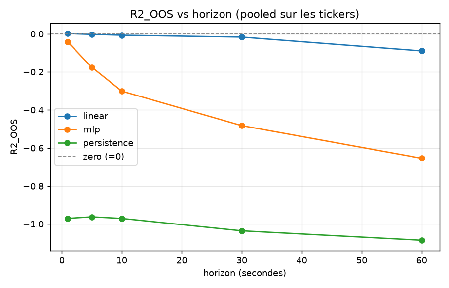
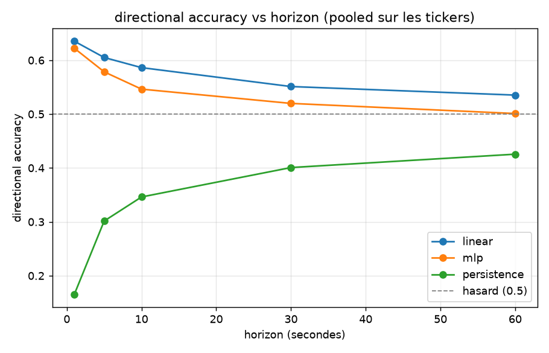

# Phase 0 — Un world model simple bat-il une baseline naïve, évalué honnêtement ?

> **TL;DR.** Sur 5 actions (LOBSTER, 2012-06-21), un modèle de séquence simple
> **ne bat aucune baseline triviale** en prédiction du rendement next-step du mid,
> à **aucun** horizon de 1 à 60 s (R²_OOS ≤ 0 partout). → **NO-GO** assumé.
> Mais l'analyse révèle un résultat plus intéressant que le verdict : il existe une
> **prédictibilité directionnelle** (signe) réelle à très court terme, **concentrée
> sur les actions large-tick** (INTC, MSFT : ~80 % de bonne direction à 1 s), qui
> **n'apparaît pas dans l'erreur quadratique** et se situe **sous l'échelle du
> spread**. C'est le cas d'école d'un *edge statistique qui est un mirage net de
> coûts* — la thèse du projet, démontrée dès la Phase 0.

---

## 1. La question (pré-enregistrée)

Un world model **simple** (MLP de séquence) prédit-il le **log-rendement du mid-price
à l'horizon suivant** **mieux** que des baselines naïves, **en out-of-sample honnête**
(anti-lookahead, walk-forward) ? Si non, c'est un résultat valide et documenté.

On évalue le marché **passif** (sans modéliser l'impact de nos ordres) — l'action-
conditioning est repoussé en Phase 1. Aucune position, aucun trade : prédiction pure.

## 2. Données

Sample gratuit **LOBSTER**, journée du **2012-06-21**, carnet reconstruit (NASDAQ).

| Ticker | Couverture | Niveaux | Barres 1 s |
|---|---|---|---|
| AMZN, GOOG, INTC, MSFT | journée 09:30–16:00 | 10 | ~23 400 |
| AAPL | 09:30–10:30 seulement | 10 (extrait d'un fichier L50) | ~3 600 |

**Limites honnêtes** : 1 seule journée, année 2012, 5 tickers. L'out-of-sample est
donc **intraday** (walk-forward sur fenêtres de la journée) — aucune prétention à
généraliser dans le temps. AAPL ne couvre qu'1 h (seul échantillon disponible).

## 3. Protocole d'évaluation (figé AVANT tout entraînement)

Tout est dans [`configs/phase0.yaml`](../configs/phase0.yaml). C'est la colonne
vertébrale du projet — il n'a pas été modifié après avoir vu les résultats.

- **Barres** clock-time 1 s ; **cible** = `log(mid_{t+h}) - log(mid_t)`.
- **Features causales uniquement** : imbalance par niveau (×10), profondeur, spread
  relatif, déviation micro-price, rendements passés laggés, OFI (order-flow imbalance).
  Chaque feature à `t` n'utilise que de l'information **≤ t**.
- **Walk-forward expansif purgé** : train = passé, test = futur, 5 folds.
  **Embargo = max(embargo, horizon)** entre train et test → une cible qui regarde
  `h` barres en avant ne peut pas fuiter dans le train.
- **Standardisation fit sur le TRAIN seulement**, appliquée au test.
- **Baselines obligatoires** : `zero` (prédire 0 = random walk / « prix inchangé »),
  `persistence` (rejouer le rendement passé sur `h` barres), `linear` (ridge sur les
  mêmes features).
- **Métrique primaire pré-enregistrée** : **R²_OOS** = `1 - SSE(modèle)/SSE(zero)`.
  `> 0` ⟺ on bat « prédire 0 ». Secondaire : *directional accuracy* (taux de bon signe).
- **Tests anti-fuite automatisés** ([`tests/test_no_lookahead.py`](../tests/test_no_lookahead.py)) :
  alignement cible=futur, embargo respecté, scaler train-only, pas de signal fantôme.

## 4. Résultats

Horizon sweep **pré-enregistré** sur le grid figé `{1, 5, 10, 30, 60}` s, **tout
reporté** (aucun cherry-pick). Valeurs *pooled* (moyenne sur tickers × folds).

### 4.1 R²_OOS — magnitude imprévisible à tous les horizons

| Horizon | linear | mlp | persistence | zero |
|---|---|---|---|---|
| 1 s | **+0.0017** | −0.042 | −0.971 | 0 |
| 5 s | −0.003 | −0.176 | −0.963 | 0 |
| 10 s | −0.007 | −0.301 | −0.971 | 0 |
| 30 s | −0.017 | −0.483 | −1.036 | 0 |
| 60 s | −0.089 | −0.654 | −1.085 | 0 |

→ **Aucun modèle ne bat le zero-forecast** (le meilleur, linéaire @1 s à +0.0017,
est **≈ 0 dans le bruit** — non significatif sans test dédié). Le MLP *overfit* et
empire avec l'horizon. La persistence est **anti-prédictive** (mean-reversion du
bid-ask bounce). **La magnitude du rendement n'est pas prédictible.**



### 4.2 Directional accuracy — un signal de signe réel, qui décroît proprement

| Horizon | linear | mlp | persistence |
|---|---|---|---|
| 1 s | **0.635** | 0.622 | 0.165 |
| 5 s | 0.605 | 0.578 | 0.302 |
| 10 s | 0.586 | 0.546 | 0.346 |
| 30 s | 0.551 | 0.520 | 0.401 |
| 60 s | 0.535 | 0.501 | 0.426 |

→ Le **signe** est prédictible mieux que le hasard à 1 s, et **décroît proprement
vers 0.5** quand l'horizon grandit. Cette décroissance lisse et *physique* est une
**preuve comportementale de non-fuite** (une fuite gonflerait toutes les échelles) —
en complément des tests unitaires.



### 4.3 La structure cachée par la moyenne : large-tick vs small-tick

La moyenne poolée (0.635) **masque une forte hétérogénéité**. Détail à 1 s :

| Ticker | dir_acc | R²_OOS | Prix moyen | Spread (ticks) | % temps à 1 tick | Régime |
|---|---|---|---|---|---|---|
| **INTC** | **0.827** | +0.018 | 27.04 $ | 1.01 | 98.8 % | large-tick |
| **MSFT** | **0.799** | +0.024 | 30.55 $ | 1.01 | 99.0 % | large-tick |
| AMZN | 0.574 | +0.003 | 222.76 $ | 12.86 | 0.2 % | small-tick |
| AAPL | 0.506 | −0.019 | 585.95 $ | 19.59 | 0.0 % | small-tick |
| GOOG | 0.473 | −0.017 | 570.68 $ | 27.36 | 0.0 % | small-tick |

La prédictibilité directionnelle est **entièrement portée par les actions large-tick**
(INTC, MSFT : prix bas, spread collé à 1 tick ~99 % du temps). C'est un effet
microstructure **bien documenté** : sur les *large-tick stocks*, le mid bouge peu et
l'imbalance du carnet prédit fortement le prochain micro-mouvement. Les small-tick
(AMZN/GOOG/AAPL, prix élevés, spread large) sont **au niveau du hasard**.

## 5. Interprétation — l'edge qui est un mirage

L'écart entre les deux métriques **est** le résultat :

- **On prédit le signe à ~80 %** sur INTC/MSFT à 1 s…
- …mais **R²_OOS ≈ 0.02** (la magnitude reste minuscule)…
- …et le mouvement prévisible est **une fraction du spread** (1 tick), qu'il faut
  **traverser** pour trader.

Donc un « edge » spectaculaire en statistique (83 % de bonne direction !) est
**inexploitable net de coûts** : le gain directionnel est sous l'échelle du spread.
C'est exactement le **model exploitation / mirage** que le projet vise à débusquer —
ici, dès la prédiction pure, sans même un agent. *Une métrique flatteuse (accuracy)
contredite par la bonne métrique économique (R² + coûts).*

## 6. Verdict Go/No-Go

**NO-GO** pour « un world model non-linéaire simple bat les baselines en R²_OOS ».
Robuste sur 5 tickers × 5 horizons. **C'est un résultat valide**, pas un échec :

> Ce qui est prédictible : le **signe** du mid à très court terme sur les **large-tick**.
> Ce qui ne l'est pas : la **magnitude** du rendement, à toute échelle testée — et le
> signal directionnel ne survit pas à l'échelle du spread.

## 7. Limites (à ne pas cacher)

- **1 journée, 2012, 5 tickers** → out-of-sample intraday uniquement.
- **Cibles à horizon `h` chevauchantes** ⟹ autocorrélation : le R²_OOS reste un
  estimateur valide, mais la **significativité** d'un +0.002 exigerait un *block
  bootstrap* (non fait ici — voir suite).
- **AAPL** ne couvre qu'1 h (échantillon plus court).
- **Coûts non intégrés** dans cette Phase 0 (prédiction pure) — mais l'argument du
  §5 montre déjà *qualitativement* qu'ils tueraient le signal directionnel.

## 8. Reproductibilité

```powershell
py -3.11 -m venv .venv
.\.venv\Scripts\python.exe -m pip install -e ".[dev]"
# déposer les samples LOBSTER dans data/raw/ (voir data/README.md)
.\.venv\Scripts\python.exe -m pytest -q            # tests anti-fuite
.\.venv\Scripts\python.exe -m mirage.eval   --config configs\phase0.yaml   # éval @1 horizon
.\.venv\Scripts\python.exe -m mirage.sweep  --config configs\phase0.yaml   # horizon sweep + figures
.\.venv\Scripts\python.exe scripts\tick_regime.py  # régime tick par ticker
```

## 9. Suites possibles

1. **Valider le signe @1 s** (block bootstrap vs coûts/spread) pour trancher
   définitivement « réel vs bruit de fold » sur INTC/MSFT.
2. **Phase 1** : vrai world model d'**état** (prédire l'évolution multi-features du
   carnet, pas un scalaire) + **action-conditioning** (impact de nos ordres).
3. **Stage 2** (bonus) : agent basé-modèle + test d'edge **net de coûts** → la
   distinction vrai edge vs model exploitation, mesurée.
