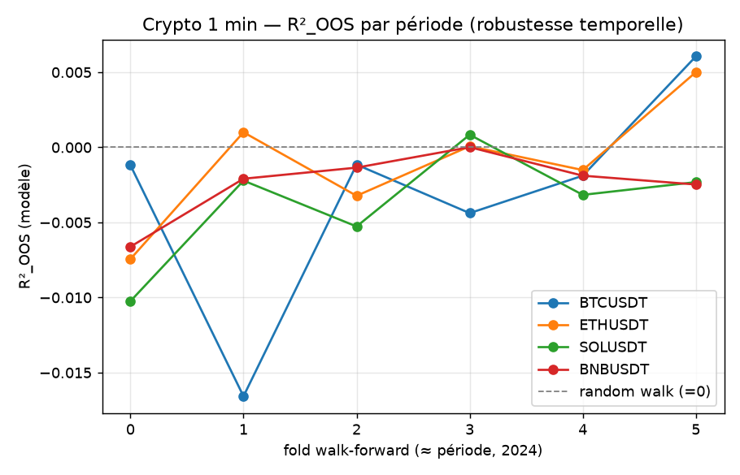

# Phase 0 (crypto) — robustesse multi-périodes / multi-symboles

> **TL;DR.** On rejoue la question de Phase 0 (le rendement next-step est-il prédictible
> mieux qu'une baseline naïve, en OOS honnête ?) mais sur **un an de données 1 min, 4
> cryptos majeures** (vs 1 seule journée LOBSTER). Verdict **inchangé et désormais robuste
> dans le temps** : à 1 min, le rendement est un **random walk** — aucun modèle ne bat
> « prédire 0 » sur **aucun** des 4 coins ni sur **aucune** des 6 périodes ; la *directional
> accuracy* est à **50 %** (hasard) ; l'edge brut (~0.06 bp) est **~80× sous les frais**.
> Le signal microstructure vu à 1 s (LOBSTER large-tick) a **totalement disparu à 1 min**.

---

## 1. Pourquoi cet ajout

Le Stage 1 (LOBSTER) était jugé sur **une seule journée (2012-06-21)**. Cet add-on
teste la **robustesse temporelle** sur un marché différent (crypto), une échelle
différente (1 min) et **12 mois** couvrant des régimes variés (rally Q1, chop, drawdown
d'été, rally Q4 2024).

## 2. Données

[Binance Vision](https://data.binance.vision/) — dumps klines gratuits, sans clé.
4 symboles, **2024 entier**, barres **1 min** : `BTCUSDT, ETHUSDT, SOLUSDT, BNBUSDT`,
**527 009 barres / symbole**. Téléchargement : `scripts/download_binance.py`.

## 3. Protocole

**Même colonne vertébrale** que la Phase 0 LOBSTER — walk-forward expansif purgé
(ici **inter-périodes** : 6 folds ≈ 2 mois chacun), scaler train-only, baselines
`zero / persistence / linear`, métrique pré-enregistrée **R²_OOS**. Config figé :
[`configs/phase0_crypto.yaml`](../configs/phase0_crypto.yaml).

Features causales OHLCV (pas de carnet) : rendements laggés, volatilité réalisée,
range relatif, **imbalance d'agresseurs** (`taker_buy` — un proxy d'order-flow gratuit
dans les klines), ratios de volume/trades. Cible = rendement log next-bar.

## 4. Résultats

| Symbole | linear | mlp | persistence |
|---|---|---|---|
| BTCUSDT | +0.00001 | −0.0032 | −1.010 |
| ETHUSDT | +0.00050 | −0.0010 | −1.039 |
| SOLUSDT | −0.00010 | −0.0037 | −1.010 |
| BNBUSDT | −0.00012 | −0.0024 | −1.007 |

Agrégat (pooled) : `dir_acc` linéaire **0.503**, mlp **0.504** (≈ hasard) ;
persistence **0.476** ; edge brut modèle **0.06 bp/barre** vs frais taker 5 bp → **négatif net**.



→ Le R²_OOS oscille autour de 0 (−0.017 à +0.006) sur **les 6 périodes × 4 coins** :
jamais d'avantage réel sur le random walk.

## 5. Interprétation

- À **1 min**, le rendement crypto est un **random walk** : magnitude imprévisible
  (R²_OOS ≤ 0), direction au hasard (50 %). Robuste sur 12 mois et 4 coins.
- Le signal **directionnel** observé à **1 s** (LOBSTER large-tick, ~80 %) **n'existe plus
  à 1 min** — cohérent : c'est un phénomène **sous-seconde** (queue/imbalance), lissé à
  l'échelle de la minute. Et même à 1 s il était sous l'échelle du spread.
- Conclusion **transverse** : sur deux marchés (actions US 2012, crypto 2024), deux
  échelles (1 s, 1 min) et deux largeurs (1 jour, 1 an), **la même histoire honnête** —
  pas d'edge net exploitable ; le peu de structure est sous-seconde et sous-coûts.

## 6. Limites

- 1 an, 4 majors, **1 min uniquement**, **OHLCV** (pas de carnet → c'est l'objet de
  l'add-on Bybit L2, à venir).
- Frais = hypothèse (5 bp taker) ; pas de slippage/queue modélisé ici (l'OHLCV n'a pas
  la profondeur — voir le moteur d'impact LOBSTER en Phase 1b).
- Rares trous de minutes (outages) non rebouchés ; effet négligeable sur les majors.

## 7. Reproductibilité

```powershell
.\.venv\Scripts\python.exe scripts\download_binance.py --symbols BTCUSDT ETHUSDT SOLUSDT BNBUSDT --start 2024-01 --end 2024-12
.\.venv\Scripts\python.exe -m mirage.crypto_eval --config configs\phase0_crypto.yaml
```

## 8. Suite

**Carnet crypto (Bybit L2)** : re-télécharger des jours de carnet L2 (gratuit,
[Bybit Historical Data](https://www.bybit.com/derivatives/en/history-data)) → rejouer
la microstructure (Phase 1a/1b) sur crypto, plusieurs jours, pour compléter l'angle LOB.
