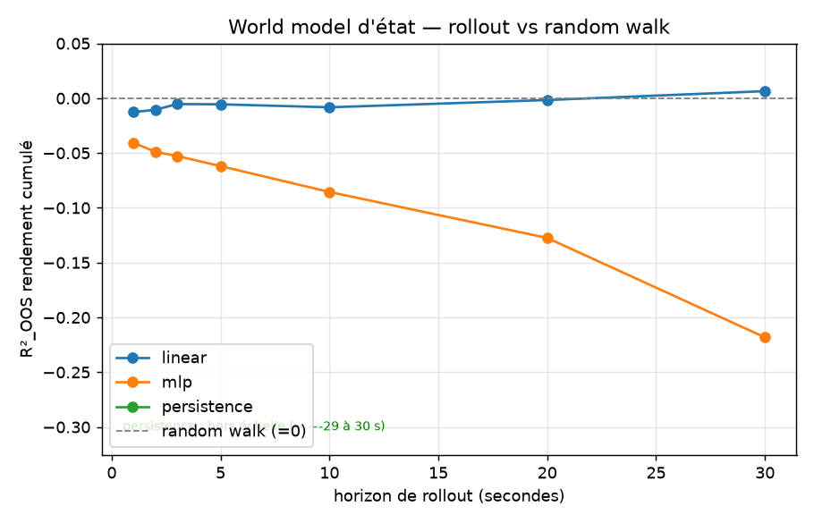

# Phase 1a — World model d'état (passif) : que prédit-il, et jusqu'où ?

> **TL;DR.** On passe d'un scalaire (Phase 0) à un **vecteur d'état** du marché
> (5 dims) prédit par un world model *déroulable* (rollout autorégressif), évalué
> honnêtement (walk-forward purgé). Résultat : **le PRIX reste un random walk** — le
> world model ne bat « le prix reste plat » à **aucun** horizon (1 s → 30 s), et le MLP
> fait *pire* (l'erreur se compose en rollout). En revanche la **FORME du carnet**
> (spread, imbalance, profondeur, micro-price) est **un peu prévisible — mais
> *linéairement* seulement** (R²_OOS 0.02–0.09 au pas suivant) ; le MLP overfit et perd
> contre « no-change » partout. Le non-linéaire n'aide pas — même leçon que Phase 0.

---

## 1. Question

Étant donné l'**état** du marché (vecteur compact de features de carnet), un world
model simple prédit-il l'**état suivant** mieux que des baselines naïves, **en
out-of-sample honnête** ? Et **jusqu'à quel horizon** sa prédiction du prix tient-elle
avant de retomber au niveau d'un random walk ?

*Phase 1a = marché **passif** (pas encore d'impact de nos ordres ; l'action-conditioning
est la Phase 1b).*

## 2. Ce qui change vs Phase 0

| | Phase 0 | Phase 1a |
|---|---|---|
| Sortie | 1 scalaire (return next-step) | **vecteur d'état (5 dims)** |
| Modèle | prédicteur | **world model déroulable** `(fenêtre d'états) → état suivant` |
| Éval | R²_OOS 1-step | R²_OOS **par dimension** + **rollout** (horizon de prédiction) |

## 3. Protocole (figé — `configs/phase1.yaml`)

- **État (5 dims)**, borné/stationnaire et *déroulable* : `ret` (Δlog-mid),
  `spread_rel`, `imb1` (imbalance L1), `depth_imb` (L1..L10), `micro_dev`.
  On prédit l'état ; on **cumule `ret`** pour reconstruire la trajectoire du prix.
- **World model** : `(16 derniers états) → état suivant`, multi-sorties. MLP par
  défaut (`mirage/wm.py`), **déroulé en autorégressif** pour le rollout.
- **Baselines** : `persistence` (l'état ne bouge pas = martingale), `mean`,
  `linear` (Ridge multi-sorties).
- **Métrique 1-step** : R²_OOS **par dimension** vs la baseline naïve *appropriée* —
  **random walk (0) pour `ret`** (un changement), **no-change pour les niveaux**
  (spread, imbalance…). Walk-forward expansif purgé, **embargo ≥ lookback**, scaler
  fit train-only (dans les modèles).
- **Métrique rollout** (la figure maîtresse) : R²_OOS du **rendement cumulé** vs random
  walk (= 0), en fonction de l'horizon. *Jusqu'où le world model prédit le prix ?*

## 4. Résultats

### 4.1 — 1-step, R²_OOS par dimension (pooled sur 5 tickers)

| Dimension | linear | mlp | mean | Lecture |
|---|---|---|---|---|
| `ret` (prix) | −0.012 | −0.041 | ~0 | **imprévisible** (random walk) — confirme Phase 0 |
| `spread_rel` | **+0.076** | −0.161 | −2.7 | forme prévisible **linéairement** ; MLP overfit |
| `imb1` | **+0.091** | −0.007 | −3.2 | idem |
| `depth_imb` | **+0.017** | −0.703 | −15 | idem (MLP overfit fort) |
| `micro_dev` | **+0.089** | −0.014 | −3.0 | idem |

- Le **MLP ne bat la baseline sur AUCUNE dimension** (il overfit partout).
- Le **linéaire bat « no-change » sur les 4 dims de forme** (R² 0.02–0.09), **pas sur le prix**.
- `mean` est catastrophique sur les niveaux : ces quantités sont **autocorrélées**
  (« no-change » ≫ moyenne).

### 4.2 — Rollout : R²_OOS du rendement cumulé vs random walk



| Horizon | linear | mlp | persistence |
|---|---|---|---|
| 1 s | −0.013 | −0.041 | −1.01 |
| 5 s | −0.006 | −0.062 | −4.91 |
| 10 s | −0.008 | −0.086 | −9.75 |
| 20 s | −0.002 | −0.127 | −19.4 |
| 30 s | +0.006 | −0.218 | −29.2 |

- **Aucun modèle ne bat le random walk** sur la trajectoire de prix, à aucun horizon.
- Le **linéaire colle à 0** (random walk). Le **MLP diverge** (l'erreur se compose en
  rollout : −0.04 → −0.22). La **persistence** est catastrophique (rejouer le dernier
  return cumule l'anti-corrélation → −29 à 30 s).

## 5. Interprétation

Le world model d'état sépare proprement **deux régimes** :
- **Le PRIX est un random walk** — invisible au world model, à toute échelle. Et un
  modèle plus expressif (MLP) *aggrave* la prédiction en rollout (compounding). C'est
  cohérent avec Phase 0 : la magnitude des rendements n'est pas prédictible.
- **La FORME du carnet** (spread, imbalances, micro-price) a une **structure linéaire
  ténue** au pas suivant — capturée par un Ridge, **pas** par le MLP (qui overfit).

→ Un « world model » utile ici prédirait surtout la **dynamique de forme** du carnet
(faiblement, linéairement), pas le prix. Le non-linéaire n'apporte rien — **même
verdict anti-mirage que Phase 0**, transposé au monde multi-dimensionnel.

## 6. Verdict Phase 1a

**Le world model d'état passif est honnêtement faible** : prix = random walk ;
forme = un filet de prédictibilité linéaire. C'est un résultat Stage-1 **valide,
cohérent et documenté** — « voilà ce qui est prédictible (un peu la forme) et ce qui ne
l'est pas (le prix) ».

## 7. L'honnêteté centrale : pourquoi l'impact (Phase 1b) n'est pas testable ici

La Phase 1b ajoutera l'**action-conditioning** : comment *nos* ordres déforment l'état
futur (impact). **Sur données historiques, cette partie n'est PAS testable** : on n'a
**aucun contrefactuel** (jamais « ce que le carnet aurait fait sans notre ordre »).
→ L'overlay d'impact sera **mécaniste** (manger le carnet + impact temporaire qui
décroît), documenté et sanity-checké, mais sa **vraie validation = ABIDES (Stage 2)**,
où la vérité-terrain existe. C'est *exactement* pourquoi le **model exploitation** est un
risque, et pourquoi on le mesurera en simulateur. **On dit ce qui est testable et ce qui
ne l'est pas.**

## 8. Limites

- **1 journée, 2012, 5 tickers** → OOS intraday (comme Phase 0).
- **État compact (5 dims)** : première étape volontairement simple (I4). L'extension
  (top-of-book élargi, L10) est une suite naturelle si la forme se révèle plus riche.
- **MLP seul** comme world model non-linéaire ; un GRU multi-sorties est une variante
  (mais le MLP overfit déjà → peu d'espoir qu'un modèle plus gros aide ici).

## 9. Reproductibilité

```powershell
.\.venv\Scripts\python.exe -m pytest -q                    # inclut le test état/rollout
.\.venv\Scripts\python.exe -m mirage.wm_eval --config configs\phase1.yaml
```

## 10. Suites

1. **Phase 1b** — overlay d'**impact mécaniste** → world model **action-conditionné**
   (documenté, sanity-checké ; validation déférée à ABIDES).
2. **Étendre l'état** (top-of-book élargi) si la dynamique de forme mérite plus de dims.
3. **Stage 2** — ABIDES : impact natif + test d'edge net de coûts → vrai edge vs
   model exploitation, *mesuré*.
