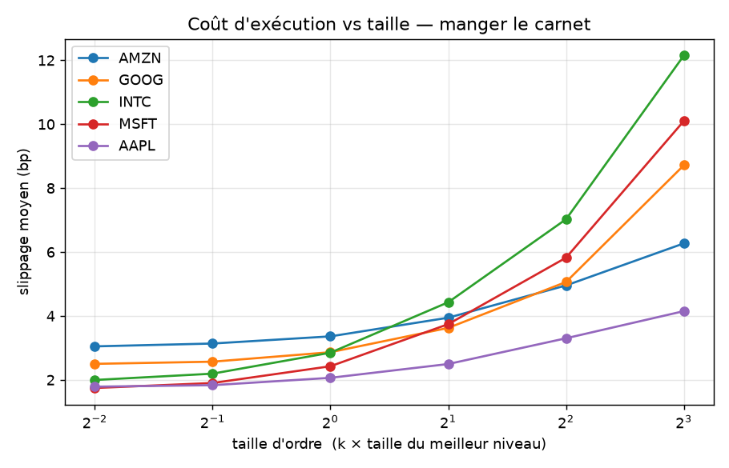
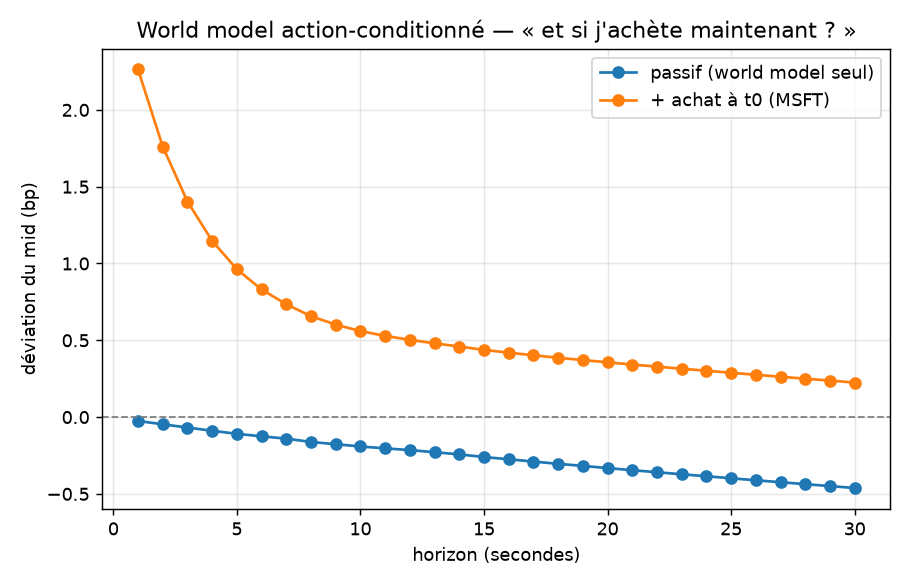

# Phase 1b — Action-conditioning : l'impact de tes ordres

> **TL;DR.** On rend le world model *action-conditionné* : `état suivant = évolution
> passive (Phase 1a) ⊕ impact de ton ordre`. L'impact a deux parties — **(1) mécanique,
> MESURABLE** sur le vrai carnet (un ordre « mange » les niveaux → slippage + saut de mid
> calculés exactement) ; **(2) dynamique de décroissance, MODÉLISÉE** (pas de
> contrefactuel sur l'historique → assumptions, validation en ABIDES). Résultat clé : même
> l'**ordre le plus petit coûte ~1.7–3 bp** (le demi-spread), et ça **monte vite** avec la
> taille (jusqu'à 8–12 bp). Or l'edge prédictible de Phase 0 était **≤ 0.1 bp**. → Le coût
> d'exécution est **17–30× l'edge** : le mirage, confirmé côté *exécution*, sur données réelles.

---

## 1. Scope et honnêteté

L'action-conditioning = comment *ton* ordre déforme l'état futur. Sur données
historiques :
- **Mesurable** (vrai carnet LOBSTER) : l'**exécution** d'un ordre au marché — quels
  niveaux il consomme, à quel prix, et le saut de mid immédiat. Déterministe, ancré réel.
- **Non mesurable** (aucun contrefactuel) : la **dynamique après le trade** (part
  permanente vs temporaire, décroissance). → forme paramétrique **documentée**,
  **validation déférée à ABIDES (Stage 2)**.

Ordres au **marché** (cas simple et déterministe). `mirage/impact.py`.

## 2. Le moteur d'exécution (mesurable)

Un achat de `q` actions consomme les asks niveau par niveau : prix d'exécution = VWAP
des niveaux mangés ; le meilleur ask remonte → le mid saute. Tout est calculé sur le
**vrai carnet**. Tests de sanité : un ordre minuscule paie le demi-spread sans bouger le
mid ; vider un niveau pousse le mid ; le slippage croît avec la taille ; un ordre > la
profondeur visible n'est pas rempli (`tests/test_impact.py`).

## 3. Courbes de coût (le résultat mesurable)

Slippage moyen (bp) pour acheter une taille `q = k × (taille du meilleur niveau)`,
out-of-sample sur la journée, par ticker :

| k × L1 | AAPL | MSFT | INTC | GOOG | AMZN |
|---|---|---|---|---|---|
| 0.25 (minuscule) | 1.79 | 1.75 | 2.00 | 2.50 | 3.05 |
| 1.0 | 2.06 | 2.43 | 2.85 | 2.86 | 3.36 |
| 4.0 | 3.30 | 5.82 | 7.03 | 5.06 | 4.95 |
| 8.0 | 4.15 | 10.10 | 12.15 | 8.72 | 6.27 |



- **Le plus petit ordre paie déjà ~1.7–3 bp** (= le demi-spread mesuré en Phase 0).
- Le coût **monte vite** avec la taille (manger le carnet).
- **Le fill-rate s'effondre** sur les small-tick : à 8×L1, GOOG n'est rempli qu'à **15 %**,
  AAPL 55 % — leurs carnets sont *fins*, on ne *peut* pas trader gros. Les large-tick
  (INTC/MSFT) ont des carnets profonds mais coûtent quand même 10–12 bp à 8×L1.

## 4. Le verrou anti-mirage, des deux côtés

| | valeur | source |
|---|---|---|
| Edge directionnel prédictible | **≤ 0.1 bp / barre** | Phase 0 §4.4 |
| Coût du plus petit ordre | **1.7 – 3 bp** | Phase 1b (ce doc) |
| Ratio coût / edge | **× 17 à × 30** | — |

→ On ne peut **pas** monétiser le signal : le franchir une seule fois coûte 20–30 fois ce
qu'il rapporte, et trader plus gros coûte *encore* plus (et ne remplit même pas). Le
« mirage » de Phase 0 est maintenant prouvé **côté exécution**, sur le vrai carnet.

## 5. Le world model action-conditionné

`état suivant = WM passif (Phase 1a) ⊕ impact(action)`. Démo « et si j'achète
maintenant ? » sur MSFT (achat de 2×L1) :



- **Sans ordre** (passif) : le mid reste ~plat (random walk — résultat Phase 1a).
- **Avec l'ordre** : le mid saute de **~2.3 bp** immédiatement, puis **décroît** vers sa
  part permanente (~0.7 bp). C'est le world model qui *répond à une action*.

## 6. Ce qui est modélisé (et donc à valider ailleurs)

La trajectoire post-trade — `impact_h = immédiat × [permanent + (1-permanent)·decay^h]`
— repose sur deux **hypothèses** (`permanent_frac`, `decay`) **non calibrables sur
l'historique** (pas de contrefactuel). L'**immédiat** (saut de mid) est mesuré ; la
**décroissance** est posée. → Sa validation = **ABIDES (Stage 2)**, où l'on contrôle le
vrai processus et peut comparer « avec » vs « sans » ordre. C'est *exactement* le terrain
du model exploitation : un agent qui exploiterait une décroissance mal calibrée
gagnerait dans le modèle, pas en vrai.

## 7. Limites

- **1 journée, 2012, 5 tickers** ; ordres au marché uniquement (pas de limit / queue).
- **Décroissance d'impact = hypothèse** (immédiat mesuré, dynamique modélisée).
- Pas de file d'attente, pas de latence, pas d'impact croisé entre ordres.

## 8. Reproductibilité

```powershell
.\.venv\Scripts\python.exe -m pytest -q                 # inclut tests/test_impact.py
.\.venv\Scripts\python.exe scripts\impact_curves.py     # courbes de coût + démo action
```

## 9. Suite

**Stage 2 (ABIDES)** : impact **natif** (le simulateur connaît la vérité-terrain) →
on calibre/valide la dynamique d'impact, on entraîne/planifie un agent basé-modèle, et
on mesure l'écart « edge dans le modèle » vs « edge en simulation » = la mesure directe
du **model exploitation**. C'est le cœur du Stage 2.
