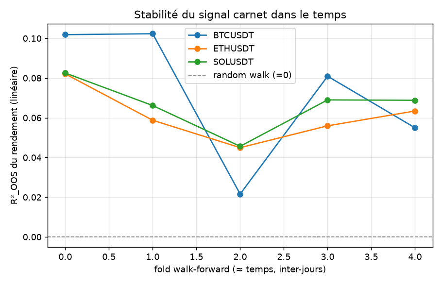
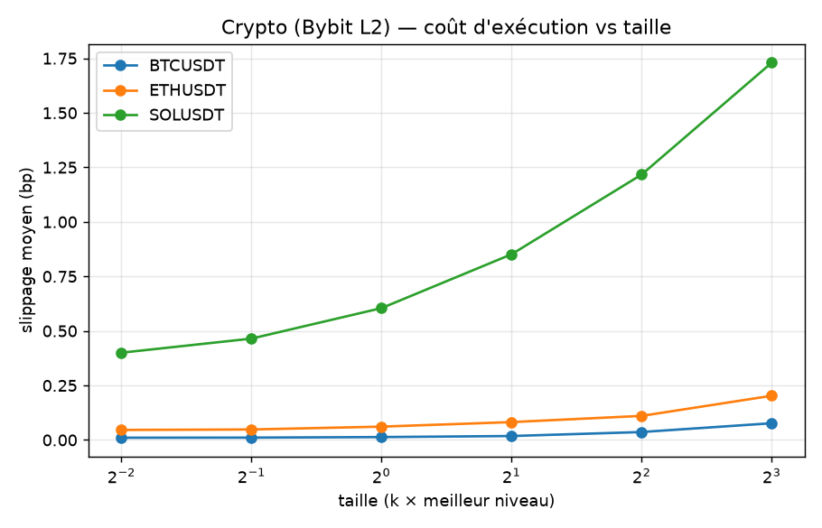

# Microstructure crypto (carnet Bybit L2) — *le* test edge-vs-mirage

> **TL;DR.** Sur le carnet crypto (**3 symboles × 6 jours**, mai→août 2025, 1,55 M barres
> 1 s), le world model d'état trouve une **vraie prédictibilité** du prochain mouvement de
> prix : **R²_OOS ≈ +0.067** (BTC 0.072 / ETH 0.061 / SOL 0.066), **positive sur 5 folds
> walk-forward inter-jours sur 5, et sur 3 symboles sur 3**. Ce n'est donc ni du bruit ni
> une particularité d'une journée. **Mais ce n'est pas un edge** : une stratégie naïve
> « signe de la prédiction » tourne ~tous les 5 s, et **dès 2 bp de frais elle perd
> lourdement** sur les 3 symboles. Mieux — **SOL est déjà mort à ZÉRO frais** : son spread
> (0.6 bp, ~60× celui de BTC) mange à lui seul 100 % du gain brut. → **MIRAGE**, démontré
> deux fois : par les frais, et par le spread seul.

---

## 1. Pourquoi ce test est central

Ailleurs dans le projet, « pas d'edge » venait surtout de **pas de signal** (prix ≈ random
walk). Ici le signal **existe vraiment** — c'est donc le *vrai* test : sait-on distinguer un
**edge** d'un **mirage** quand le modèle est convaincu d'avoir trouvé de l'or ? La réponse
honnête (net de coûts) est non, et on la **chiffre**.

## 2. Données

Carnet L2 **Bybit** (gratuit, scriptable — `quote-saver.bycsi.com`, dumps `ob500`,
500 niveaux, snapshot + deltas ~10 ms), reconstruit en **barres 1 s top-10** au format
LOBSTER.

| | |
|---|---|
| Symboles | BTCUSDT, ETHUSDT, SOLUSDT |
| Dates | 2025-05-08, 05-22, 06-02, 06-18, 07-09, 08-06 |
| Volume | ~86 400 barres/jour → **518 k échantillons/symbole**, **1,55 M au total** |
| Régimes | BTC 100 k→114 k ; ETH 1 983→3 629 $ (gros rally) ; SOL 147→178 |

**Rigueur multi-jours** : l'état et les fenêtres sont construits **par journée** puis
concaténés — aucune fenêtre à cheval sur deux jours, aucun rendement calculé par-dessus la
nuit, aucun faux retournement de position à minuit, et **le walk-forward purgé devient
inter-jours** (train sur les jours passés → test sur les jours futurs). Ces règles sont
isolées et **testées** dans `mirage/backtest.py`.

Pipeline : `scripts/fetch_bybit_batch.py` → `mirage/data/bybit_lob.py` → `scripts/crypto_lob.py`.

## 3. Phase 1a — une vraie prédictibilité, robuste

R²_OOS 1-step par dimension (baseline : 0 pour `ret`, no-change pour les niveaux) :

| Dim | linear | mlp | mean |
|---|---|---|---|
| `ret` (prix) | **+0.067** | +0.070 | ~0 |
| `spread_rel` | 0.481 | 0.493 | −0.150 |
| `imb1` | 0.233 | 0.259 | −0.340 |
| `depth_imb` | 0.184 | 0.203 | −1.248 |
| `micro_dev` | 0.383 | 0.391 | 0.241 |

**Par symbole** (`ret`, linéaire) : BTC **+0.072**, ETH **+0.061**, SOL **+0.066**.



→ Le signal est **positif sur les 5 folds × 3 symboles** (0.02–0.10), sans jamais toucher
zéro. C'est une prédictibilité **réelle et persistante**, pas un artefact d'une journée.

Rollout du rendement cumulé : **positif jusqu'à 30 s** pour le linéaire (0.071 → 0.012) ;
le MLP repasse négatif vers 10–20 s (il overfit / compose l'erreur).


Mécanisme : la **micro-price / l'imbalance des files** prédisent le prochain micro-mouvement
du mid — effet documenté, fort sur les perps crypto. Le signal **ne vient pas du prix passé**
(la persistence est franchement anti-prédictive : −0.81).

## 4. Phase 1b — le coût dépend beaucoup du symbole

Slippage du plus petit ordre testé (0.25 × meilleur niveau), moyenné sur les 6 jours :

| Symbole | slippage min | spread moyen | fill-rate à 8×L1 |
|---|---|---|---|
| BTCUSDT | **0.010 bp** | ~0.009 bp | 0.2 % |
| ETHUSDT | **0.046 bp** | ~0.04 bp | 0.7 % |
| SOLUSDT | **0.400 bp** | **~0.6 bp** | 100 % |



BTC/ETH ont des spreads minuscules mais des carnets **fins au-delà des 10 premiers niveaux**
(le fill-rate s'effondre avec la taille). SOL a un carnet profond mais un spread **~60× plus
large**.

## 5. LE verdict économique

Stratégie naïve : position = signe de la prédiction (linéaire OOS) ; coût à chaque
changement de position = demi-spread **réel mesuré** + frais taker.

| Symbole | frais | gross/barre | turnover | **net/barre** |
|---|---|---|---|---|
| BTCUSDT | 0 bp | +0.107 bp | 0.216 | **+0.105 bp** |
| BTCUSDT | 2 bp | +0.107 bp | 0.216 | **−0.760 bp** |
| BTCUSDT | 5.5 bp | +0.107 bp | 0.216 | **−2.275 bp** |
| ETHUSDT | 0 bp | +0.213 bp | 0.349 | **+0.200 bp** |
| ETHUSDT | 2 bp | +0.213 bp | 0.349 | **−1.196 bp** |
| ETHUSDT | 5.5 bp | +0.213 bp | 0.349 | **−3.640 bp** |
| **SOLUSDT** | **0 bp** | +0.228 bp | 0.352 | **−0.0004 bp** ⚠️ |
| SOLUSDT | 2 bp | +0.228 bp | 0.352 | **−1.409 bp** |
| SOLUSDT | 5.5 bp | +0.228 bp | 0.352 | **−3.874 bp** |


### Le cas SOL — le mirage sans même invoquer les frais
SOL a le **gross le plus élevé** des trois (+0.228 bp/barre, signal aussi fort qu'ETH). Et
pourtant, **à zéro frais**, son net est **nul (−0.0004 bp)**. Raison : son demi-spread
(~0.3 bp) × son turnover (0.35) consomme **exactement** le gain brut. Autrement dit :

> **Même sans aucun frais, ce signal n'est pas exploitable dès que le spread est réaliste.**
> Le mirage ne tient pas à un choix d'hypothèse de frais — il est structurel.

*Note de lecture honnête* : les « PnL cumulés » (ex. +327 % / −7 073 %) sont la **somme
arithmétique des rendements par barre** sur ~310 k barres de test, pas un rendement de compte
composé — au-delà de −100 % on serait liquidé bien avant. Le chiffre à retenir est le
**net par barre** ; le cumul n'illustre que l'ampleur.

## 6. Interprétation — edge réel, mirage économique

- Le signal est **réel et robuste** : positif sur 3 symboles × 5 folds inter-jours, mécanisme
  documenté, décroissance de rollout lisse → ni bruit, ni fuite (§8).
- Il n'est **pas un edge** : le coût de l'exécuter (spread + frais, × un turnover élevé)
  dépasse le gain sur les 3 symboles. **Significatif ≠ rentable.**
- Un backtest « gross » naïf aurait crié victoire. L'éval honnête, **pré-enregistrée et nette
  de coûts**, dit non. *C'est exactement le piège que le projet existe pour éviter.*
- Élargir les données a **renforcé** les deux moitiés du résultat : le signal est plus
  crédible (6 jours, 3 coins) **et** le verdict mirage plus solide (SOL le tue sans frais).

## 7. L'angle honnête qui reste ouvert (et où se cache le model exploitation)

La stratégie testée est **taker**. En **maker / post-only** (frais nul voire rebate),
l'arithmétique change — mais on hérite du **risque de non-exécution**, non modélisé ici.
**On ne le revendique donc pas.** C'est précisément le terrain où les backtests optimistes
prospèrent : supposer des fills parfaits et gratuits. Le trancher demande un **simulateur à
impact natif (ABIDES, Stage 2)** ou des données d'exécution réelles. *(À noter : sur SOL,
même un frais nul ne suffit pas — le spread seul tue le signal.)*

## 8. Pourquoi c'est réel, pas une fuite

- Mécanisme **documenté** (micro-price/imbalance → prochain mid), pas une corrélation fortuite.
- **Décroissance lisse** du rollout — signature d'un signal éphémère réel ; une fuite
  gonflerait tous les horizons.
- **Causalité vérifiée** : les features à `t` (carnet à la clôture de la seconde `t`)
  prédisent le mouvement `t→t+1`. Tests anti-fuite du repo + tests dédiés aux frontières de
  jours.
- Le MLP **overfit** en rollout là où le linéaire tient → cohérent avec un vrai signal
  *linéaire* faible.

## 9. Limites

- **6 jours** sur mai→août 2025 (fenêtre réelle de l'archive Bybit), **3 symboles**.
- Stratégie **signe naïve** : pas de sizing, pas de filtre de confiance, pas de maker.
- Frais = hypothèses (2 / 5.5 bp) ; pas de modèle de file d'attente ni de latence.
- Top-10 niveaux (les carnets BTC/ETH ont beaucoup de profondeur au-delà).

## 10. Reproductibilité

```powershell
.\.venv\Scripts\python.exe scripts\fetch_bybit_batch.py --symbols BTCUSDT ETHUSDT SOLUSDT `
    --dates 2025-05-08 2025-05-22 2025-06-02 2025-06-18 2025-07-09 2025-08-06
.\.venv\Scripts\python.exe scripts\crypto_lob.py
```

---

**Conclusion.** Le carnet crypto fournit le cas d'école parfait : un world model qui trouve
un signal de prix **réel et robuste** (3 coins, 6 jours, 5/5 folds), un backtest brut
flatteur, et une éval honnête qui montre que **net de coûts c'est un mirage** — sur SOL,
**avant même de compter le moindre frais**. Tout le projet tient dans l'écart entre le gross
et le net.
