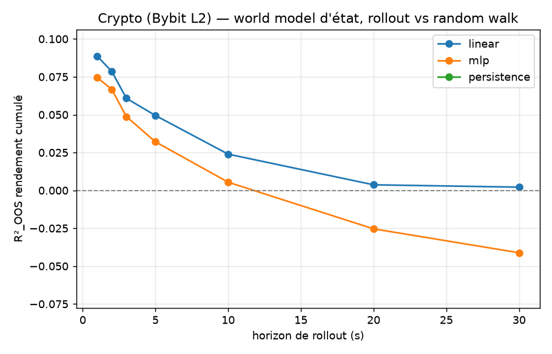
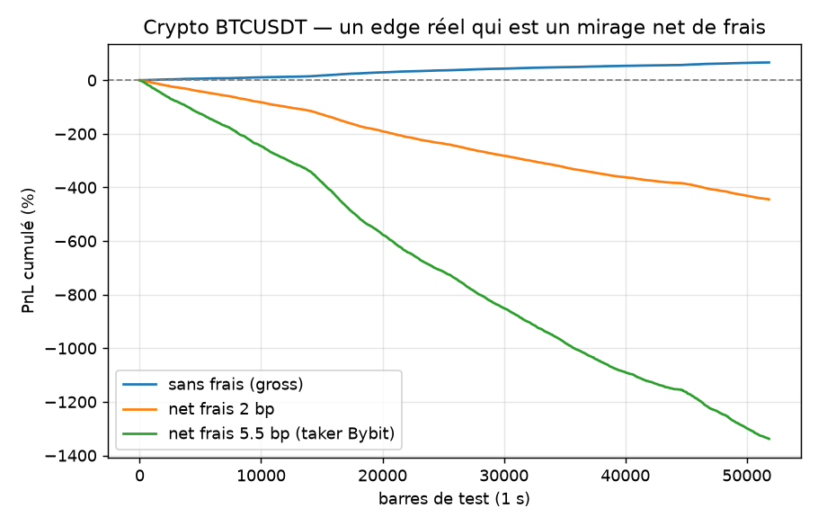

# Microstructure crypto (carnet Bybit L2) — *le* test edge-vs-mirage

> **TL;DR.** Sur le carnet crypto (BTC/ETH perps, 1 s), le world model d'état trouve une
> **vraie prédictibilité** du prochain mouvement de prix : **R²_OOS = +0.086** (vs ~0 sur
> actions 2012 et crypto 1 min), positive en rollout jusqu'à ~20 s. Les spreads sont
> minuscules (0.01–0.04 bp). Une stratégie naïve « signe de la prédiction » fait
> **+66 % (BTC) / +120 % (ETH) en une journée… sans frais**. **Mais** elle tourne ~tous les
> 4 s, et **dès 2 bp de frais elle fait −444 % / −656 %** ; à frais taker Bybit (5.5 bp),
> **−1338 % / −2014 %**. → **MIRAGE** : un signal *réel* (pas un bruit), **détruit par les
> coûts**. C'est la thèse du projet, démontrée de la façon la plus nette.

---

## 1. Pourquoi ce test est central

Jusqu'ici, « pas d'edge » venait surtout de **pas de signal** (prix ≈ random walk). Ici,
pour la première fois, **le signal existe vraiment** — c'est donc le *vrai* test : sait-on
distinguer un **edge** d'un **mirage** quand le modèle, lui, est convaincu d'avoir trouvé
de l'or ? La réponse honnête (net de coûts) est non, et on le **chiffre**.

## 2. Données

Carnet L2 **Bybit** (gratuit, scriptable — `quote-saver.bycsi.com`, dumps `ob500`).
BTCUSDT + ETHUSDT, **2025-06-02**, reconstruits (snapshot + deltas) en **barres 1 s
top-10** au format LOBSTER → **86 401 barres/symbole**. Pipeline :
`scripts/download_bybit_lob.py` (téléchargement) → `mirage/data/bybit_lob.py` (loader,
rejoue snapshot+deltas) → `scripts/build_bybit_bars.py` (cache .pkl) → `scripts/crypto_lob.py`
(analyse).

## 3. Phase 1a — une vraie prédictibilité

R²_OOS 1-step par dimension (baseline : 0 pour `ret`, no-change pour les niveaux) :

| Dim | linear | mlp | mean |
|---|---|---|---|
| `ret` (prix) | **+0.086** | +0.076 | ~0 |
| `spread_rel` | 0.497 | 0.492 | 0.498 |
| `imb1` | 0.224 | 0.217 | −0.40 |
| `depth_imb` | 0.213 | 0.202 | −0.47 |
| `micro_dev` | 0.419 | 0.413 | 0.292 |

→ Contrairement aux actions 2012 (`ret` ≈ 0), le **prix crypto à 1 s est prédictible**
(R²_OOS +0.086). Rollout du rendement cumulé **positif jusqu'à ~20 s** (linéaire), le MLP
repassant négatif vers 12 s (il overfit / compose l'erreur) :



C'est cohérent avec la microstructure : la **micro-price / l'imbalance** prédisent le
prochain micro-mouvement du mid (effet documenté, fort sur les perps crypto).

## 4. Phase 1b — en crypto, le coût n'est pas le spread, c'est le FRAIS

Coût d'exécution (slippage) **minuscule** : plus petit ordre ≈ **0.008 bp (BTC) / 0.037 bp
(ETH)**. Le spread crypto est ridicule. **Le vrai coût, c'est le frais taker** (~2 à 5.5 bp
chez Bybit) — payé à *chaque* trade.

## 5. LE verdict économique

Stratégie naïve : position = signe de la prédiction (linéaire OOS), coût = demi-spread
(réel) + frais taker à chaque changement de position.

| Symbole | frais | gross/barre | turnover | **net/barre** | **PnL cumulé** |
|---|---|---|---|---|---|
| BTCUSDT | 0 bp | +0.130 bp | 0.246 | +0.128 bp | **+66 %** |
| BTCUSDT | 2 bp | +0.130 bp | 0.246 | −0.857 bp | **−444 %** |
| BTCUSDT | 5.5 bp | +0.130 bp | 0.246 | −2.581 bp | **−1338 %** |
| ETHUSDT | 0 bp | +0.247 bp | 0.374 | +0.232 bp | **+120 %** |
| ETHUSDT | 2 bp | +0.247 bp | 0.374 | −1.265 bp | **−656 %** |
| ETHUSDT | 5.5 bp | +0.247 bp | 0.374 | −3.886 bp | **−2014 %** |



L'**écart entre la courbe gross (qui monte) et les courbes nettes (qui s'effondrent) EST la
mesure du mirage** — entièrement dû au produit *turnover × frais*. L'edge brut (~0.13–0.25
bp/barre) est réel mais **bien plus petit que le frais payé à chaque retournement**.

## 6. Interprétation — edge réel, mirage économique

- Le signal est **réel** : R²_OOS positif, gross positif et régulier (+66 %/jour), décroissance
  de rollout lisse et physique → ce n'est **pas** du bruit ni (cf. §8) une fuite.
- Il n'est **pas un edge** : avec des frais taker réalistes, le coût de l'exécuter dépasse
  largement le gain. **Significatif ≠ rentable**, version la plus spectaculaire (vs Phase 0/1b
  LOBSTER où le signal était déjà sous le spread).
- Un backtest « gross » naïf aurait crié **+66 % en un jour**. L'éval honnête (net de frais,
  pré-enregistrée) dit **−444 %**. *C'est exactement le piège que le projet existe pour éviter.*

## 7. L'angle honnête qui reste ouvert (et où se cache le model exploitation)

La stratégie testée est **taker** (on paie le frais à chaque trade). En **maker / post-only**
(frais nul voire rebate), l'arithmétique change — mais on hérite alors du **risque de
non-exécution** (fill incertain), non modélisé ici. **On ne le revendique donc pas.** C'est
*précisément* le terrain où les backtests optimistes (et le model exploitation) prospèrent :
supposer des fills parfaits sans coût. Le trancher proprement demande un **simulateur à
impact natif (ABIDES, Stage 2)** ou des données d'exécution réelles.

## 8. Pourquoi c'est réel, pas une fuite

- Mécanisme **documenté** (micro-price/imbalance → prochain mid) ; pas une corrélation
  fortuite.
- **Décroissance lisse** du rollout vers 0 (≈20 s) — signature d'un signal éphémère réel ;
  une fuite gonflerait tous les horizons.
- **Causalité vérifiée** : les features à `t` (carnet à la clôture de la seconde `t`)
  prédisent le mouvement `t→t+1` ; aucune info future. Mêmes tests anti-fuite que tout le repo.
- Le MLP **overfit** (rollout repasse négatif) là où le linéaire tient → cohérent avec un
  vrai signal *linéaire* faible.

## 9. Limites

- **1 journée, 2 symboles, 2025** ; stratégie **signe naïve** (pas de sizing, pas de maker,
  pas de filtre sur la confiance).
- Frais = hypothèses (2 / 5.5 bp) ; pas de modèle de queue/latence.
- Top-10 niveaux (le carnet crypto a beaucoup de profondeur au-delà → `fill_rate` chute vite).

## 10. Reproductibilité

```powershell
.\.venv\Scripts\python.exe scripts\download_bybit_lob.py --symbols BTCUSDT ETHUSDT --dates 2025-06-02
.\.venv\Scripts\python.exe scripts\build_bybit_bars.py   # reconstruit les barres 1s (.pkl)
.\.venv\Scripts\python.exe scripts\crypto_lob.py         # Phase 1a + 1b + verdict économique
```

---

**Conclusion.** Le carnet crypto fournit le cas d'école parfait : un world model qui trouve
un **vrai** signal de prix, un backtest brut flatteur (+66 %), et une éval honnête qui
montre que **net de frais, c'est un mirage** (−444 %). Tout le projet tient dans l'écart
entre ces deux nombres.
